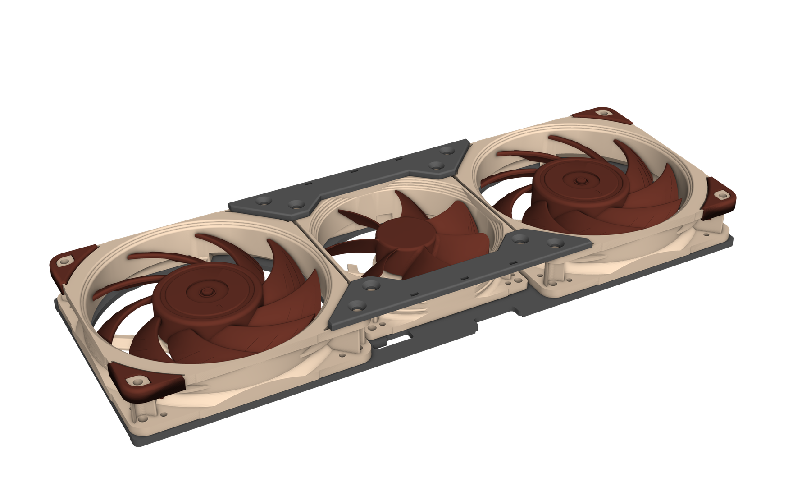
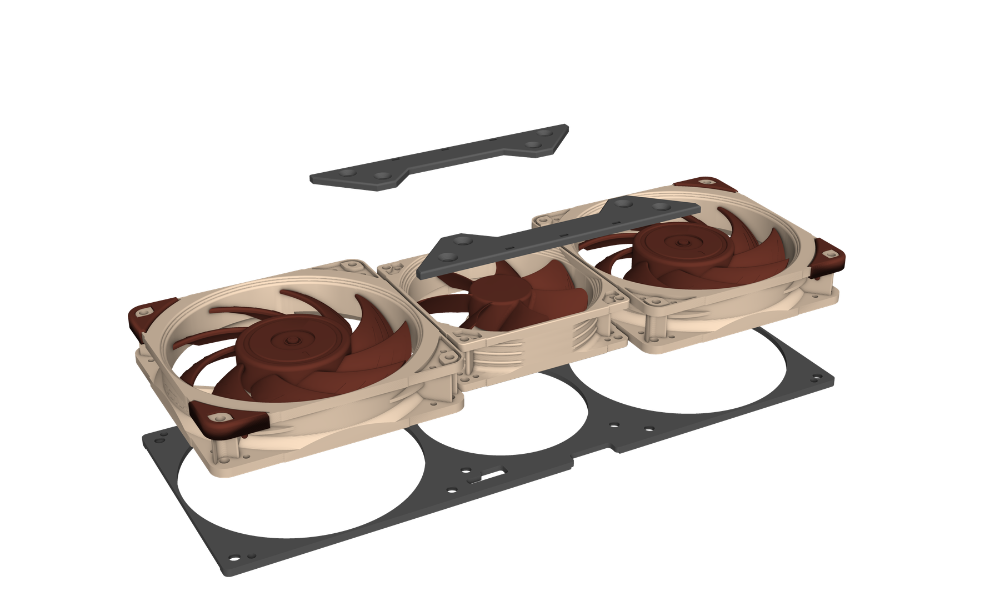
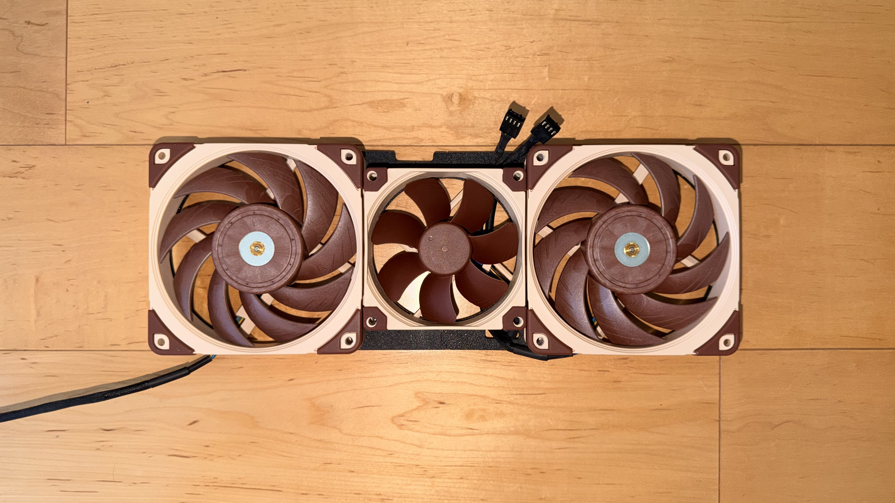
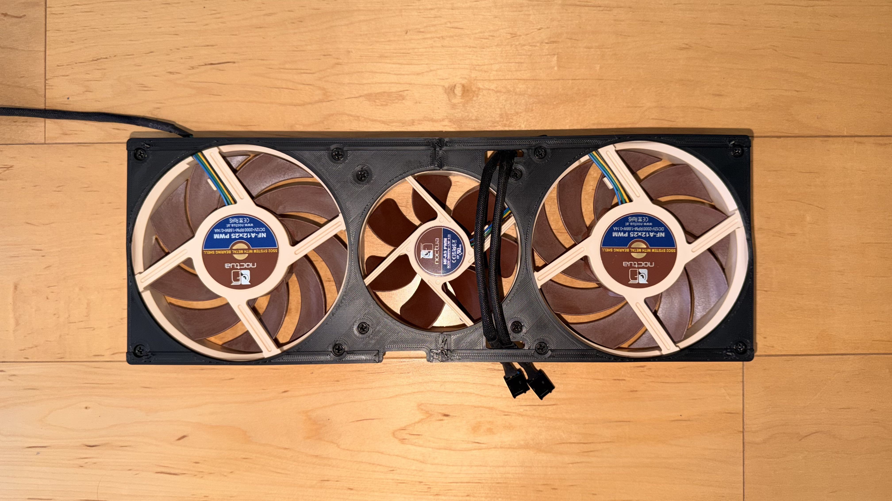
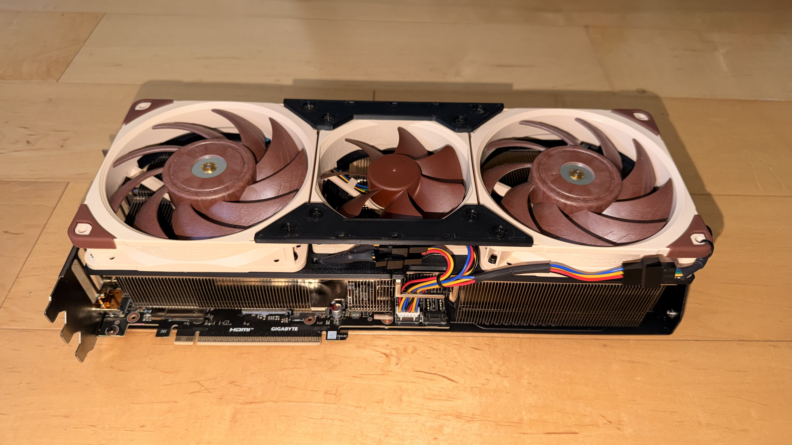
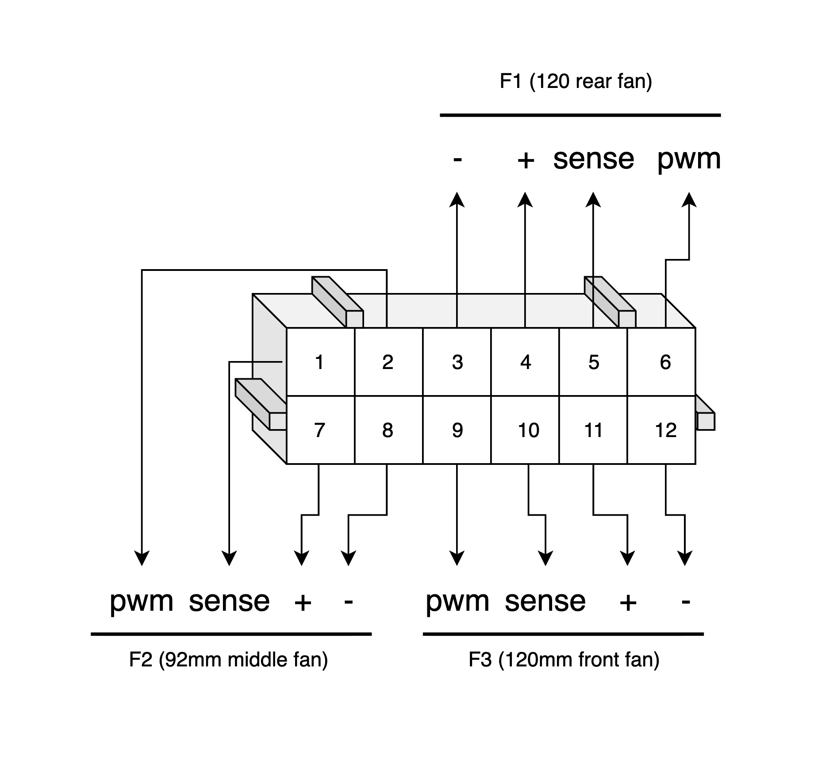

# Fan plate for a deshrouded Gigabyte RTX 5080 Gaming OC

A 3D-printed plate that mounts two Noctua NF-A12x25 (120 mm) fans and one NF-A9 (92 mm) on the bare heatsink
of a Gigabyte RTX 5080 Gaming OC, using four existing holes in the heatsink. The fans screw to the plate from
underneath, with their rubber corner pads removed, and two joiners tie them together on their outer face.

Designed around my own card, no guarantees this will fit every other card of the same model. You can
optionally forego the adapter plate and just zip tie the fans to the heatsink.

## Files

| File | What it is |
|---|---|
| `models/5080-gaming-oc-fan-plate_half-A-ports.stl` | Port-side half of the plate |
| `models/5080-gaming-oc-fan-plate_half-B-rear.stl` | Rear half of the plate |
| `models/5080-gaming-oc-fan-plate_full.stl` | The plate in one piece (332.8 x 121.0 mm), for beds that fit it |
| `models/top_joiner.stl` | Joiner for the outer face of the fans. Print two and turn one around |
| `models/5080-gaming-oc-fan-plate_full.step` | The plate as a solid model, for CAD programs |
| `templates/5080-plate-hole-template_*.pdf` | 1:1 paper templates of the hole layout (US Letter in two pages, US Legal in one) |

## Printing

- **The files are true size. Scale them for shrinkage.** Print one half at 100%, measure the plate width
  (modelled at 121.0 mm), and scale X and Y by 121.0 divided by your measurement. The parts
  shown here were printed in ABS at 100.7%, Z at 100%. Over the 310.75 mm between the rail screw holes,
  even 0.5% is 1.5 mm, so do not skip this.
- Use a material that tolerates heat. ABS, ASA or PETG; not PLA.

## Hardware

- 4 M2 screws with a 3.75 mm cylindrical head, 6 mm or longer, and 4 M2 nuts.
- 12 standard case-fan screws for the plate, plus 8 for the two joiners.

## Assembly

1. Push the two halves together until the flat faces touch.
2. Fit the four M2 screws into their pockets from the fan side. The pockets are made slightly too tight on
   purpose: push each screw in with the tip of a soldering iron, like a heat-set insert, and the plastic
   closes around the head so the screw is held firmly and cannot spin.
3. Screw the fans to the plate from the underside.
4. Pass the fan connectors through the stepped openings beside the 92 mm fan and slide each wire into the
   shallow end of its opening. Do this before the plate goes on the card.

   

   
   
   

5. Lower the plate onto the heatsink so the ridges rest on the bars and the M2 screws pass through the bar
   holes, then fit the nuts from below.
6. Screw a joiner across the outer face of the fans on each long side.

## Fan harness

The card has a single fan header, a 2.0 mm pitch JST PHD 2 x 6 connector, so the three fans need a custom
harness. This is the pinout of the harness's own connector, the female JST plug that goes onto the card's header:

The harness in the pictures was made from two kits: [4-pin fan connector plugs](https://www.amazon.com/dp/B08HYTGH7D)
for the fan side and a [JST PHD connector kit](https://www.amazon.com/dp/B0CKZF94RR) for the card side. You need
a crimp tool to attach the JST connector wires to the fan header pins.

Before printing, lay the paper template on the heatsink at 100% and check that the four ringed crosses sit
over the bar holes. The plate extends 5.9 mm past the port end of the heatsink and 7.9 mm
past the rear; make sure your card and case have that room.

## Changing the design

Everything is generated by a Python script. Parameters, what they do, and how to regenerate the files are in
[docs/changing-the-design.md](docs/changing-the-design.md).

## License

Models, templates and documentation: [CC BY 4.0](LICENSE-CC-BY-4.0). Scripts: [MIT](LICENSE). Noctua's fan
CAD files in `reference/` are Noctua's, included as downloaded from their website.
