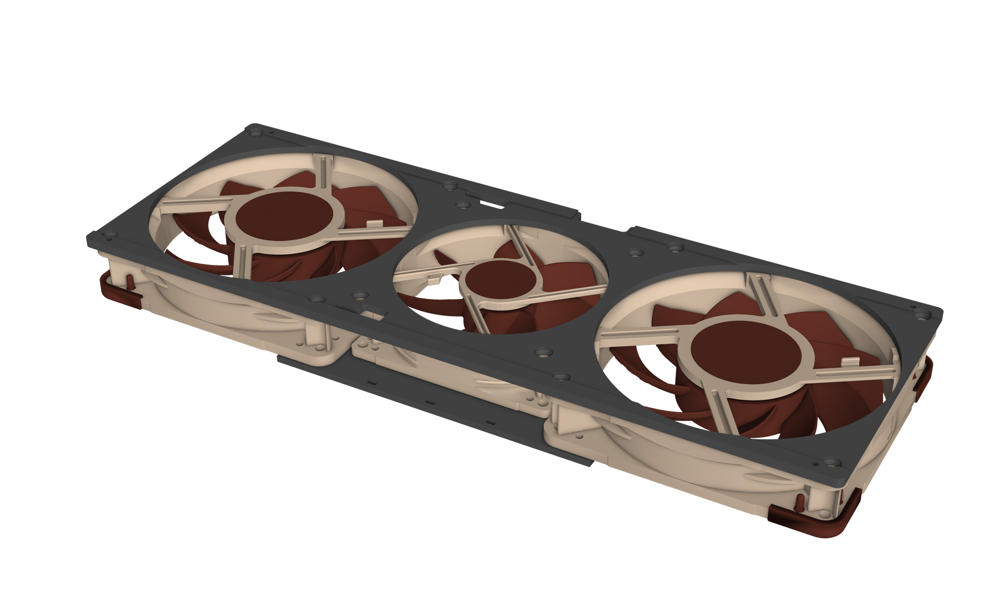

# Changing the design

The plate, the joiner, this file and the README are all written by `fan_plate.py`. Change a number at the top
of the script, run it, and every file follows. All dimensions are in millimetres. The view is from the fan
side with the ports on the left: X runs along the card, Y across it, Z = 0 is the fin tops.

## Setting up

You need Python 3.10 to 3.12 with CadQuery. The paper templates need `reportlab` and the renders `pyvista`.
Install into a virtual environment:

    python3 -m venv .venv
    .venv/bin/pip install -r requirements.txt

## Regenerating

    .venv/bin/python fan_plate.py              # models/ (STL, STEP, joiner), README.md, this file, preview/*.svg
    .venv/bin/python joiner.py                 # the joiner on its own
    .venv/bin/python tools/paper_template.py   # templates/*.pdf (its numbers are typed in by hand: update them
                                               # whenever holes, fans, cutout or openings move)
    .venv/bin/python tools/render_meshes.py    # fine meshes of the fans, plate and joiner for rendering, into preview/render/
    .venv/bin/python tools/render.py           # renders/: the pictures

The fan screws and the rail screws sit very close together at the corners. After any change to the holes or
the fans, read the lines the script prints for each rail hole: they give the plastic left between the screw
pocket and the nearest fan screw hole. Keep that above about 1 mm.

## Shrinkage, in more detail

Rough shrinkage by material. Treat these as starting points, since brand, chamber temperature and part
position on the bed all change the result:

| Material | Typical shrinkage |
|---|---|
| PLA | 0.2% to 0.5% (softens near a hot GPU, so not recommended) |
| PETG | 0.3% to 0.6% |
| ABS, ASA | 0.4% to 0.8% (the original prints measured 0.5% to 0.7%; the final print used 100.7%) |
| Polycarbonate | 0.5% to 0.8% |
| Nylon | 1% to 2%, less for fibre-filled grades |

Shrinkage can differ along and across a long part. To check, also measure the port-side half from its outer
end to the flat face where the halves meet (modelled at 165.4 mm) and use a separate factor for that axis.
Measure on a single half, never across the joint. Print the final parts with the same material, settings and
bed position as the test.

## Parameters

**Different rail screws**

- `HEAD_D`: diameter of the head pocket. Use the head diameter plus about 0.05 for a snug fit.
- `HEAD_DEPTH`: depth of the pocket. Use the head height plus about 0.2.
- `RAIL_HOLE_D`: clearance hole for the thread.
- `PLATE_T`: keep it at least 0.8 more than `HEAD_DEPTH`, so there is a floor under the head.

**Different fan screws**

- `FS_HEAD_D`, `FS_TAPER_H`, `FS_THREAD_D`: head diameter, height of the tapered part of the head, and thread diameter.
- `FS_RECESS`: how far the head sits below the underside of the plate.

**Different hole positions on the heatsink**

- `RAIL_CC_Y`: distance between the two rows of holes, across the card.
- `TOP_BAR`, `BOT_BAR`: length of each bar. Both bars are assumed to end flush at the rear of the heatsink.
- `TOP_INSET`, `BOT_INSET`: distance from the end of each bar to the centre of its hole.
- `RAIL_STRETCH`: a correction added to the lengthwise spacing, split between both ends.
- `FIN_L`, `FIN_W`: length and width of the heatsink.
- `PAD_H`: height of the ridges. Set it to how far the bars sit below the fin tops, or slightly more.

**Fan positions**

- `FAN_SHIFT`: where the fan row starts, measured from the port end of the heatsink (negative is in front of it).
- `FAN_GAP`: gap between neighbouring fans.
- `FAN_OFF_Y`: sideways offset of the whole fan row.
- `F120`, `F92`, `F92_FRAME_HALF`: fan sizes, screw spacing and opening diameters, for fans other than these Noctuas.
  The joiner (`joiner.py`) takes its hole positions from the same layout.

**Wire openings and cutout**

- `FIN_GAP_START`, `FIN_GAP_W`: position and width of the gap in the fins that the wire openings sit over.
- `RAIL_W`: width of the bar there. The openings start at its inner edge.
- `CONN_W`, `WIRE_SLOT_H`: width of the connector part and depth of the wire slot.
- `WIRE_START`, `WIRE_END`, `WIRE_DEPTH`: the cutout in the bottom edge, measured from the two bottom rail holes.

**Splitting for the print bed**

- `SPLIT_X`: where the halves join. Keep it inside the 92 mm opening and clear of the edge cutout.
- `JOINT_CLEAR`, `TAB_NECK`, `TAB_LEN`: fit and size of the dovetails.

The paper templates are drawn for this exact design and are not regenerated by the script, so after changing
hole positions, check the new layout another way, for example by printing a thin test piece of each corner.
